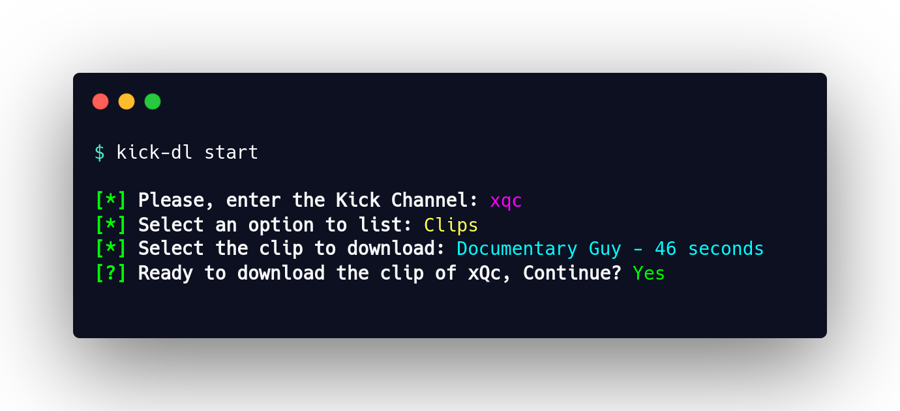

# :sparkles: Kick-DL :green_heart:


**Kick-DL is a command-line interface (CLI) tool designed for easily downloading VODs and Clips from Kick.com**



> [!NOTE]
> CLI tool is inspired by [Twitch-DL](https://github.com/ihabunek/twitch-dl), created by [@ihabunek](https://github.com/ihabunek)

## Table of Contents :books:

- [Features :rocket:](#features-rocket)
- [Requirements :gear:](#requirements-gear)
- [Support Us :sparkling_heart:](#support-us-sparkling_heart)
- [Installation :package:](#installation-package)
- [Disclaimer :warning:](#disclaimer-warning)
- [Contributing :handshake:](#contributing-handshake)
- [License :scroll:](#license-scroll)
- [Contact :email:](#contact-email)

## Features :rocket:

- **Global Installation**: Install it anywhere on your system and access it from any terminal with no hassle.
- **Easy VOD Downloads**: Download Videos on Demand (VODs) from Kick quickly and easily with simple commands.
- **Fast Clip Downloads**: Grab and save clips from Kick effortlessly using an intuitive command-line interface.
- **Customizable Options**: Adjust settings like format and quality to get exactly what you want.

## Requirements :gear:

To use Kick-DL, ensure you have the following installed:

1. **Node.js**: Version 14.0.0 or higher. Download it from [Node.js official site](https://nodejs.org/).
2. **youtube-dl**: This tool is used internally for video downloading. Install it using pip:

    ```sh
    pip install --upgrade youtube-dl
    ```

3. **ffmpeg**: Required for handling media files. Installation varies by operating system:

    - **On Windows**: Download from [FFmpeg official site](https://ffmpeg.org/download.html) and follow the installation instructions.
    - **On macOS**: Use Homebrew:

        ```sh
        brew install ffmpeg
        ```

    - **On Linux**: Install via your package manager. For example, on Ubuntu:

        ```sh
        sudo apt update
        sudo apt install ffmpeg
        ```

## Support Us :sparkling_heart:

If you find this project useful and want us to keep improving it, please consider:

- **Star the Repo**: [Give it a star](https://github.com/juliogarciape/kick-dl) on GitHub to help increase its visibility.
- **Support via Paypal** *(Soon)*: If your donation was just $1, it would really make this guy very happy.
- **Share**: Let others know about this project.

## Installation :package:

To install Kick-DL, run the following command in your terminal:

**using npm**:

```sh
npm install -g kick-dl
```

**using pnpm**:

```sh
pnpm add -g kick-dl
```

## Disclaimer :warning:

This project is not affiliated, associated, authorized, endorsed by, or in any way officially connected with `Kick` or any of its subsidiaries or its affiliates. The official Kick website can be found at [https://kick.com/](https://kick.com/). `Kick` as well as related names, marks, emblems and images are registered trademarks of their respective owners.

## Contributing :handshake:

We welcome contributions! If you have suggestions, improvements, or bug fixes, please submit a `Pull Request` or open an `Issue`.

## License :scroll:

This project is licensed under the Apache-2.0 License. See the [LICENSE](LICENSE) file for more details.

## Contact :email:

For questions or support, please contact me at [dev.juliogarciape@gmail.com](mailto:dev.juliogarciape@gmail.com).
